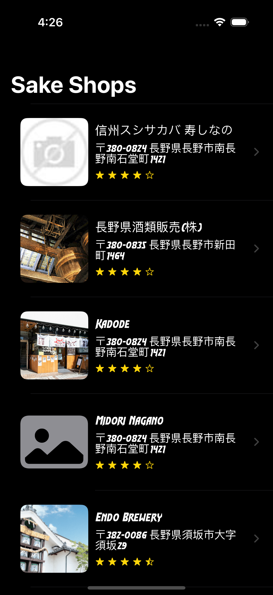
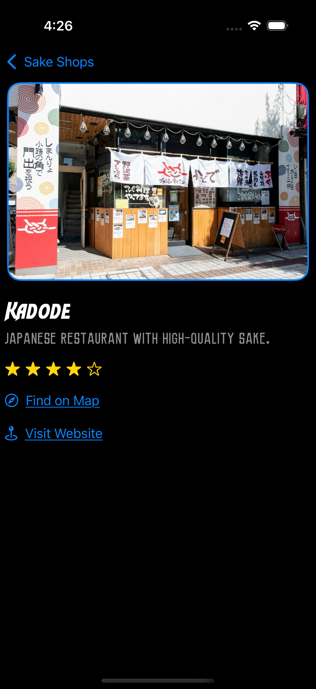
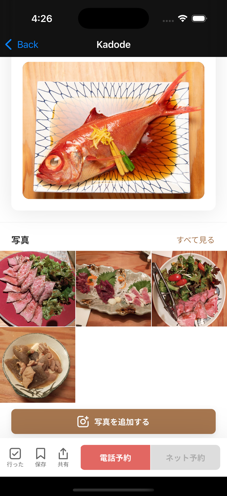
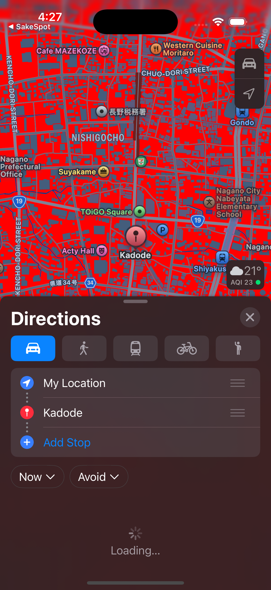

# SakeSpot 🍶

SakeSpot is an iOS app that helps users discover and explore various sake shops. Built using **SwiftUI** and **Combine**, the app fetches data from a local JSON file and presents shop details, ratings, maps, and more in a clean and intuitive interface.

---

## 🚀 Features

- 📍 Browse a curated list of sake shops with images, ratings, and descriptions  
- 🗺️ Tap a shop to open its location directly in **Apple Maps**  
- 🌐 View the shop's website within the app using **WKWebView**  
- 🧠 Efficient image loading and caching using `NSCache`  
- 📦 **Modular architecture** with reusable SwiftUI components  
- ✅ Unit tested with Combine and mock services for robust code

---

## 📁 Folder Structure

SakeSpot/
├── SakeSpotApp.swift # App entry point
├── ContentView.swift # Root view
├── SakeShops/ # Shop model, views, and view models
├── Network/ # API service protocols and mock services
├── CommonViews/ # Reusable SwiftUI UI components
├── ShopDetails/ # Detailed view for each shop
├── ViewModifiers/ # Custom SwiftUI view modifiers
├── Constant/ # App constants and localized strings
├── Assets.xcassets # Image and color assets
├── SakeShopsListData.json # Local JSON data for development
---

## 🧪 Testing

- Unit tests are located in the `SakeSpotTests/` directory  
- Uses `MockApiService` for injecting sample JSON data  
- Observes Combine publishers with `@Published` for reactive updates  

---

## 🛠️ Technologies Used

- Swift 5 / SwiftUI  
- Combine framework  
- XCTest for unit testing  
- `URLProtocol` for network requests  
- Apple Maps via `MKMapItem`  
- JSON decoding using `Codable`

---

## 🛠️ Installation

1. **Clone the repository:**
    ```bash
    git clone https://github.com/Gurpreet0790/SakeSpot.git
    ```

2. **Open the project in Xcode:**
    - Open `SakeSpot.xcodeproj`

3. **Build and Run:**
    - Target an iOS Simulator or device (iOS 16+ recommended)

---

## 📸 Screenshots

Screenshots are located in the project under:  
**`SakeSpot/Screenshots/`**

<div align="center">
  <h3>🏠 Home Screen</h3>
  
  <h3>🛍️ Shop Details</h3> 
     
</div>


<div align="center">
    <h3> Website View</h3>
    
    <h3> Map View</h3>
    
</div>


